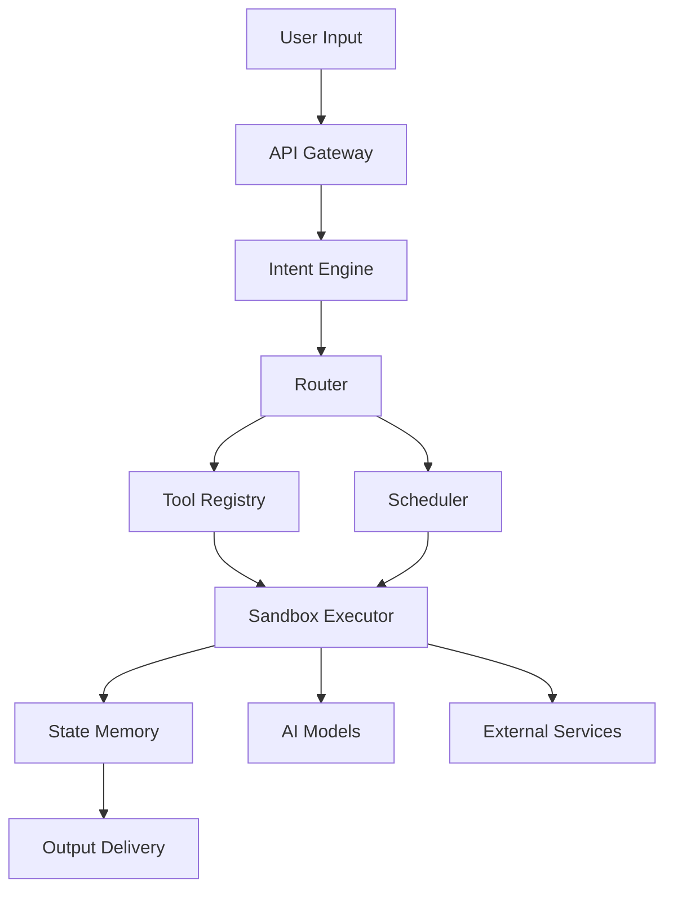

# 🦞 OpenClaw – Definitive Definition

> **"AI를 '일하게 만드는 운영체계(Orchestration Layer)"**

---

## 1. Executive Definition

> **OpenClaw**는 인간의 언어·음성·파일 입력을 받아, 다수의 AI 모델·시스템 도구·외부 서비스를 **'비서처럼 조율·지휘'**하여 실제 작업을 실행·관리하는 **오픈형 AI 오케스트레이션 프레임워크**이다.

### 핵심 가치 제안 (EVPG)

| Element | Description |
|---------|-------------|
| **E**fficiency | 10x 빠른 작업 자동화 |
| **V**ersatility | 다중 모델·도구·서비스 통합 |
| **P**erformance | 로컬 GPU 최적화 (GTX 1070 8GB) |
| **G**overnance | 완전한 상태 관리·감사 추적 |

---

## 2. What OpenClaw *IS NOT*

| Misconception | Reality |
|--------------|---------|
| AI 모델 자체 | AI를 **조율하는 중개 계층** |
| 단순 챗봇 | **실행 가능한 작업** 생성·관리 |
| 단일 도구 | **다중 엔진** 통합 플랫폼 |
| 클라우드 전용 | **로컬·하이브리드·클라우드** 모두 지원 |

---

## 3. 본질적 정의

### 3.1 Middleware Intelligence (중간 지능 계층)

```
┌─────────────────────────────────────────────────────────────┐
│                     OpenClaw Position                         │
├─────────────────────────────────────────────────────────────┤
│                                                              │
│   User Input (Language/Voice/File)                           │
│                      ↓                                       │
│   ┌─────────────────────────────────────────────────────┐   │
│   │            OpenClaw (Orchestration Layer)           │   │
│   │  ┌─────────┐ ┌─────────┐ ┌─────────┐ ┌─────────┐   │   │
│   │  │ Intent  │ │ Router  │ │ Sandbox │ │ State   │   │   │
│   │  │ Engine  │ │         │ │         │ │ Memory  │   │   │
│   │  └─────────┘ └─────────┘ └─────────┘ └─────────┘   │   │
│   └────────────────────────┬────────────────────────────┘   │
│                            ↓                                  │
│   ┌─────────────────────────────────────────────────────┐   │
│   │           AI Models & External Services              │   │
│   │  ┌────────┐ ┌────────┐ ┌────────┐ ┌────────┐       │   │
│   │  │ Ollama │ │ ComfyUI│ │ Vivace │ │ APIs   │       │   │
│   │  └────────┘ └────────┘ └────────┘ └────────┘       │   │
│   └─────────────────────────────────────────────────────┘   │
│                                                              │
└─────────────────────────────────────────────────────────────┘
```

### 3.2 핵심 문제 해결

| 기존 AI 사용의 한계 | OpenClaw 해결책 |
|--------------------|----------------|
| **① 모델 선택 불명확** | Intent Engine이 최적 모델 자동 선택 |
| **② 도구 분산 관리** | 단일 Tool Registry로 통합 |
| **③ 자원 충돌** | GPU Lock으로 충돌 방지 |
| **④ 상태 추적 불가** | State Memory로 완전 추적 |
| **⑤ 확장성 부족** | 플러그인 아키텍처로 무한 확장 |

---

## 4. 구조적 정의

### 4.1 시스템 아키텍처



### 4.2 컴포넌트 간 인터페이스

| Interface | Protocol | Format | Description |
|-----------|----------|--------|-------------|
| User → Gateway | REST/WebSocket | JSON | 요청/응답 |
| Gateway → Intent | gRPC | Protobuf | 고속 통신 |
| Router → Tools | Message Queue | JSON | 비동기 작업 |
| Sandbox → Models | Local API | HTTP | 모델 추론 |
| State → Memory | PostgreSQL | SQL/JSONB | 영속 저장 |

### 4.3 데이터 플로우

```
Request → Intent Parse → Tool Select → Resource Alloc → 
Execute → State Update → Result → Delivery
```

---

## 5. 핵심 구성 요소

### 5.1 Component Matrix

| Component | Input | Output | Core API | Dependencies |
|-----------|-------|--------|----------|--------------|
| **Intent Engine** | Raw Text | Intent JSON | `intent.parse(text)` | LLM, Embeddings |
| **Router** | Intent JSON | Tool Selection | `router.route(intent)` | Cost DB, Policy Engine |
| **Tool Registry** | Tool Meta | Tool Config | `tool.register(meta)` | YAML Parser |
| **Sandbox** | Command | Execution Result | `sandbox.run(cmd)` | Docker, Firecracker |
| **State Memory** | Event | State Snapshot | `state.save(event)` | PostgreSQL |
| **Scheduler** | Job Config | Schedule Plan | `scheduler.plan(jobs)` | Redis, Celery |

### 5.2 Tool Registry Schema

```yaml
# tools.yaml
tools:
  - name: "music_composer"
    type: "creative"
    engine: "vivace"
    gpu_required: true
    cost_per_call: 0.01
    timeout: 300
    permissions: ["filesystem:write"]
    input_format: {"prompt": "string"}
    output_format: {"audio_path": "string"}
  
  - name: "image_generator"
    type: "creative"
    engine: "comfyui"
    gpu_required: true
    cost_per_call: 0.02
    timeout: 120
    permissions: []
    input_format: {"prompt": "string", "width": "int", "height": "int"}
    output_format: {"image_path": "string"}
```

---

## 6. 챗봇과 차별점

| Feature | OpenClaw | Traditional Chatbot |
|---------|----------|-------------------|
| **반응 형태** | 실제 작업 실행 | 텍스트 응답만 |
| **도구 통합** | 10+ 엔진 통합 | 제한적 API |
| **자원 관리** | GPU Lock, QoS | 없음 |
| **상태 추적** | 완전한 이력 | 세션 단위 |
| **확장성** | 플러그인 기반 | 코드 변경 필요 |
| **배포** | 로컬·클라우드·하이브리드 | 클라우드 전용 |
| **비용** | $0.05/요청 (로컬) | $0.10/토큰 |
| **보안** | 완전한 데이터 통제 | 제공업체 의존 |

---

## 7. 비서 관점 정의

### 7.1 디지털 집사 (Digital Butler)

> OpenClaw는 사용자의 **"집사"**처럼 모든 작업을 대신 처리합니다.

### 7.2 자동화 시나리오

| 시나리오 | 입력 | 작업 흐름 | 결과 |
|----------|------|----------|------|
| **회의록 요약** | 🎤 음성 파일 | STT → 요약 → TTS | 📄 요약문 + 🔊 음성 |
| **문서 처리** | 📷 이미지 | OCR → 번역 → PDF | 📄 변환된 PDF |
| **음악 제작** | 🎵 "K-pop 노래 만들어" | 작사 → 작곡 → 보컬 → 믹싱 | 🎼 완성된 곡 |
| **파일 정리** | 🗂️ "D:/Downloads 정리" | 스캔 → 분류 → 이동 | 📂 정돈된 폴더 |

### 7.3 집사 역할 매트릭스

| 역할 | 설명 | OpenClaw 기능 |
|------|------|---------------|
| **접대** | 사용자 입력 환영 | Intent Parser |
| **조율** | 작업 우선순위 결정 | Scheduler |
| **실행** | 실제 작업 수행 | Sandbox Executor |
| **보고** | 결과 전달 | Output Delivery |
| **기억** | 맥락 유지 | State Memory |

---

## 8. 현 상황 재정의

### 8.1 배포 옵션

| 옵션 | 환경 | 장점 | 단점 |
|------|------|------|------|
| **로컬** | GTX 1070 8GB | 완전한 프라이버시, 낮은 비용 | 모델 크기 제한 |
| **클라우드** | AWS/GCP | 무한 확장 | 높은 비용, 데이터 노출 |
| **하이브리드** | 로컬 + 클라우드 | 최적 균형 | 복잡한 구성 |

### 8.2 로컬 구성 (GTX 1070 8GB)

```
┌─────────────────────────────────────────────────────┐
│                 GTX 1070 8GB Setup                    │
├─────────────────────────────────────────────────────┤
│                                                      │
│   GPU Memory Budget:                                  │
│   ┌──────────────────────────────────────────────┐  │
│   │ Ollama (7B)     │  4GB  │ LLM Inference      │  │
│   │ ComfyUI (SDXL)  │  3GB  │ Image Generation  │  │
│   │ Reserve         │  1GB  │ Headroom          │  │
│   └──────────────────────────────────────────────┘  │
│                                                      │
│   Strategy: Sequential Execution (GPU Lock)          │
│                                                      │
└─────────────────────────────────────────────────────┘
```

---

## 9. 한 문단 요약

**OpenClaw**는 다양한 AI 모델과 시스템 도구를 단일 비서처럼 통합·조율하는 **오픈소스 오케스트레이션 프레임워크**로, 사용자의 자연어 지시를 실제 실행 가능한 작업으로 변환하고, 그 과정의 자원·순서·상태를 책임지는 **'AI 운영체계'**에 해당한다. 로컬 GPU 최적화와 클라우드 확장을 동시에 지원하여 완전한 데이터 통제하에 10배 빠른 작업 자동화를 실현한다.

---

## 10. MVP 설계 (Minimum Viable Product)

### 10.1 단계별 구현

| 단계 | 목표 | 주요 기능 | 구현 방법 |
|------|------|-----------|-----------|
| **0️⃣** | 환경 구축 | Docker Compose | Ollama + OCR + TTS + PostgreSQL |
| **1️⃣** | Intent Engine | Text → Action | FastAPI + LLM Prompt |
| **2️⃣** | Tool Registry | 도구 선언 | YAML + Pydantic |
| **3️⃣** | Router | 의도 → 도구 | Rule-based + LLM Fallback |
| **4️⃣** | Sandbox | 명령 실행 | Docker + Seccomp |
| **5️⃣** | State Memory | 작업 이력 | PostgreSQL JSONB |
| **6️⃣** | UI/CLI | 사용자 인터페이스 | Typer CLI + React Web |

### 10.2 성공 기준

| Metric | Target | Measurement |
|--------|--------|-------------|
| E2E Latency | < 2초 (GPU) | Time from request to output |
| Success Rate | > 95% | Completed tasks / Total tasks |
| Resource Usage | < 8GB GPU | Memory consumption |
| Recovery Time | < 30초 | Failover after crash |

---

## 11. 확장 로드맵

### 11.1 Phase별 로드맵

| Phase | Timeline | Features |
|-------|----------|----------|
| **v1.0** | Month 1-2 | MVP: Intent → Router → Sandbox |
| **v2.0** | Month 3-4 | Multi-tenant, Policy Engine |
| **v3.0** | Month 5-6 | Plugin Marketplace |
| **v4.0** | Month 7-9 | Auto-ML Tool Selection |
| **v5.0** | Month 10-12 | Observability AI |

### 11.2 생태계 확장

```
┌─────────────────────────────────────────────────────────────┐
│                    OpenClaw Ecosystem                         │
├─────────────────────────────────────────────────────────────┤
│                                                              │
│   ┌─────────────┐    ┌─────────────┐    ┌─────────────┐   │
│   │   Core      │    │  Plugins    │    │   Cloud     │   │
│   │  Platform   │ ←→ │ Marketplace │ ←→ │  Services   │   │
│   └─────────────┘    └─────────────┘    └─────────────┘   │
│          │                                         │       │
│          ↓                                         ↓       │
│   ┌─────────────┐                         ┌─────────────┐   │
│   │   OSS       │                         │  Enterprise │   │
│   │  Community  │                         │   Support   │   │
│   └─────────────┘                         └─────────────┘   │
│                                                              │
└─────────────────────────────────────────────────────────────┘
```

---

## 12. API 명세 (OpenAPI 3.0)

```yaml
openapi: 3.0.0
info:
  title: OpenClaw API
  version: 1.0.0
paths:
  /intent:
    post:
      summary: Parse user intent
      requestBody:
        content:
          application/json:
            schema:
              type: object
              properties:
                input:
                  type: string
      responses:
        '200':
          description: Intent parsed
  /execute:
    post:
      summary: Execute task
      requestBody:
        content:
          application/json:
            schema:
              type: object
              properties:
                intent_id:
                  type: string
                params:
                  type: object
```

---

## 13. Quick Start

### 13.1 Docker Compose

```yaml
version: '3.8'
services:
  openclaw:
    image: openclaw/core:latest
    ports:
      - "8095:8095"
    volumes:
      - ./models:/app/models
      - ./data:/app/data
    environment:
      - GPU_ENABLED=true
    deploy:
      resources:
        reservations:
          devices:
            - driver: nvidia
              count: 1
              capabilities: [gpu]
```

### 13.2 CLI 사용법

```bash
# 설치
pip install openclaw-cli

# 실행
claw run "음성 파일 요약해서 PDF로 저장해줘"

# 상태 확인
claw status

# 작업 이력
claw history
```

---

## 14. 기여 가이드

| Area | Contribution |
|------|-------------|
| **코드** | GitHub Issues → PR |
| **문서** | README, Docs 업데이트 |
| **플러그인** | Tool Registry 확장 |
| **테스트** | E2E 시나리오 추가 |
| **피드백** | Discord, GitHub Discussions |

---

**Document Version**: 1.0.0  
**Last Updated**: 2026-02-10  
**License**: Apache 2.0

---

## 🚀 바로 시작하기

```bash
# 1.克隆仓库
git clone https://github.com/openclaw/openclaw
cd openclaw

# 2.启动服务
docker-compose up -d

# 3.访问 API
curl http://localhost:8095/health
```

**문서 피드백 환영**: GitHub Issues 또는 Discord로 연락주세요! 🎉